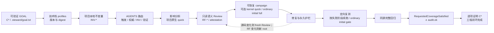
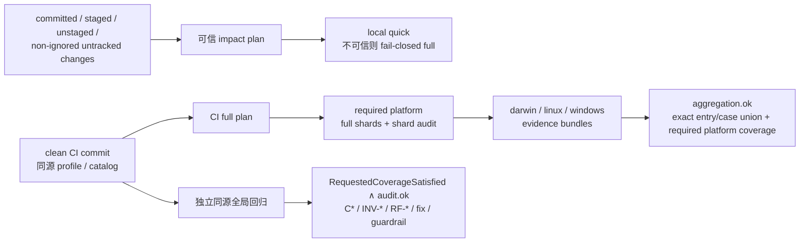

# Steward

Steward 是同时面向 Codex 与 Claude Code 的工程控制面：以仓库事实为依据，用“薄编排器 + 稳定机器契约 + 可独立调用技能”把 GOAL、项目不变量、语义风险、验证证据和永久技术护栏连成可恢复、可审计的闭环。两个宿主安装同一个插件并加载同一个 `skills/` 目录；插件包含七个共享技能，普通任务只调用所需技能，只有用户明确要求完整持久工程闭环时才使用总编排器。

## 安装

Codex：

```bash
codex plugin marketplace add coachpo/plugins --ref main
codex plugin add steward@coachpo
```

Claude Code：

```bash
claude plugin marketplace add coachpo/plugins@main
claude plugin install steward@coachpo
```

安装或更新后，请新建 Codex 任务或 Claude Code 会话以加载最新技能。

## 快速开始

在目标仓库中打开新的 Codex 任务或 Claude Code 会话，再用完整技能名说明要得到的结果。插件不会因为安装而扫描仓库、持久化 GOAL、运行测试或生成 `.steward/`；这些效果只会在对应请求明确授权后发生。

两个宿主调用的是同一份技能入口：

```text
# Codex
使用 $steward:<skill-name> <你的目标、范围和期望结果>

# Claude Code
使用 /steward:<skill-name> <你的目标、范围和期望结果>
```

### 先选择最窄的技能

| 你的目标 | 使用的技能 | 默认效果 |
| --- | --- | --- |
| 检查或维护 `AGENTS.md` 层级 | `write-agent-guides` | 审查默认只读；明确要求更新时才修改授权的 `AGENTS.md`，不创建或改写 `CLAUDE.md` |
| 检查或刷新项目文档、静态开发档位策略 | `write-project-docs` | 审查默认只读；明确要求维护时才修改授权文档 |
| 得到一份可评审或可执行的 GOAL 合同 | `draft-consensus-goal` | 返回机器校验的七行 GOAL；不开始执行，仅在超限或明确要求时创建条件式 handoff |
| 只做行为级、对抗式代码审查 | `review-semantic-risks` | 严格只读，不运行测试、不修复代码 |
| 审查或配置 local quick 与 CI full | `configure-project-verification` | `review` 零写入；`configure` 只写启动前冻结的配置输出 |
| 校验、执行、恢复或审计已有 adapter | `run-closed-loop-verification` | 运行已审查 case 并保存可恢复证据；修复源码需要额外授权 |
| 把一项已授权工程改动放入完整持久闭环 | `run-engineering-control-loop` | 持久化 `.steward/goal.txt`，冻结标准控制产物写集，并只编排原请求授权的源码效果 |

普通文档、单次审查或一次测试不需要总编排器。只有明确需要“GOAL + 不变量 + 独立 Review + 修复复测 + 完整回归 + audit”的整条链路时，才使用 `run-engineering-control-loop`。

### 可直接复制的请求

以下示例使用 Codex 调用形式；在 Claude Code 中把 `$steward:` 换成 `/steward:`。

只读检查仓库指引：

```text
使用 $steward:write-agent-guides 只读审查当前仓库的 AGENTS.md 层级，报告重复、缺失和作用域错误，不修改文件。
```

刷新项目文档：

```text
使用 $steward:write-project-docs 根据当前仓库事实和 STATUS 开发档位刷新项目文档与静态开发策略；保留已有用户内容，只修改明确授权的文档。
```

起草 GOAL：

```text
使用 $steward:draft-consensus-goal 把当前已经收敛的讨论整理成机器校验的七行 GOAL；不要开始执行，仅在超限或我明确要求时创建交接文档。
```

只读语义审查：

```text
使用 $steward:review-semantic-risks 只读审查当前 diff 的行为风险；只报告有代码证据、可达触发路径、可观察后果和可证伪反例的问题。
```

配置验证流水线：

```text
使用 $steward:configure-project-verification 先只读审查当前项目的 local quick、CI full、平台与输出路径；不要写文件，先报告建议配置和精确写入清单。
```

运行已有验证闭环：

```text
使用 $steward:run-closed-loop-verification 校验现有 adapter，执行可恢复验证并完成同源完整回归与 audit；本请求不授权修改源码。
```

完整工程闭环：

```text
使用 $steward:run-engineering-control-loop 将这项已授权的工程改动放入完整持久闭环；把已接受的 GOAL 规范保存到 .steward/goal.txt，并以项目内 journal 恢复，直到完成标准被证明或出现正当阻塞。
```

### 运行前需要确认

- 多数捆绑 validator、文档和验证命令需要 PATH 中可用的 `python3`；Git 变更观测和 portable evidence 还需要 Git。
- 完整工程闭环以规范的 `.steward/goal.txt` 和 campaign journal 为恢复事实源；宿主对话、任务或续跑状态只改善体验，不是完成证据。
- 只读请求不会授权写文件。明确的维护或完整工作流请求会授权其预先披露并冻结的项目内写集；范围外路径、外部或破坏性效果仍需另行确认。
- adapter 会执行其中声明的命令。执行或恢复前应审查完整 `argv`、工作目录、runner、fixture、能力和可能副作用。
- GitHub workflow 只是一种静态投影；插件不会设置远程 variable、Secrets、required checks、branch protection，也不会替项目安装依赖或配置 runner。
- 推送、部署、访问真实服务或设备、使用凭据、购买、破坏性操作及其他外部写入始终需要单独授权。

### 可能创建或修改的内容

| 请求类型 | 可能产生的项目内容 |
| --- | --- |
| 只读审查、状态、设计或 audit | 不修改项目文件 |
| 文档或 AGENTS 维护 | 仅修改请求授权的规范文档或 `AGENTS.md`；不会创建或改写 `CLAUDE.md`，也不会为完整性创建无证据内容 |
| GOAL 起草 | 默认只返回文本；正文压缩后仍超过 4,000 code points 或用户明确要求时，才在 `.steward/handoffs/` 下创建临时、被忽略的背景文件 |
| 完整工程闭环 | 在启动前披露并冻结的写集内持久化 `.steward/goal.txt`、request/Review handoff、adapter、campaign 与 evidence |
| Profile 与不变量维护 | 明确维护请求在启动前冻结的写集内保存 profile selection 和 `.steward/invariants.json` 等持久控制文件 |
| 验证流水线配置 | 在配置请求冻结的 `allow-write` 集内写入 CI plan、本地入口和 GitHub workflow |
| Closed-loop campaign | 在所选操作冻结的 adapter/campaign/evidence 路径保存 journal、attempt、artifact、fix audit、Review handoff 和平台 evidence |
| 源码修改 | 仅限原工程请求明确授权的初始改动，或明确包含 fix-and-retest 的失败修复 |

删除 `.steward/` 可能同时删除项目配置、GOAL、恢复状态和验证证据，不应把它当作普通缓存整体清理。插件也不会自动提交、推送或部署上述内容。

### 机器入口的最小示例

普通用户应优先调用技能；只有需要直接调试机器契约时，才从插件根目录调用下列入口。路径参数可以使用目标项目中的绝对路径：

```bash
# 只读校验 verification profile
python3 scripts/project_verification.py validate-profile \
  --project-root /path/to/project \
  --profile /path/to/project/.steward/verification-profile.json

# 只读比较 profile 声明的 adapter、CI plan、本地入口和 workflow
python3 scripts/project_verification.py review \
  --project-root /path/to/project \
  --profile /path/to/project/.steward/verification-profile.json

# 校验、查看或审计同一个 closed-loop adapter
python3 skills/run-closed-loop-verification/scripts/campaign.py validate-adapter \
  --adapter /path/to/project/.steward/project-adapter.json
python3 skills/run-closed-loop-verification/scripts/campaign.py status \
  --adapter /path/to/project/.steward/project-adapter.json
python3 skills/run-closed-loop-verification/scripts/campaign.py audit \
  --adapter /path/to/project/.steward/project-adapter.json
```

`configure` 会写多个静态输出，因此必须重复传入每个精确的项目相对 `--allow-write` 路径；先使用技能的只读 `review` 模式取得冻结清单，不要猜测输出位置。

### 常见阻塞与恢复

- **找不到技能或仍加载旧版本：**确认插件安装成功，并在安装或更新后新建 Codex 任务或 Claude Code 会话。
- **缺少或不兼容 GOAL：**先校验显式 GOAL 或 `.steward/goal.txt`；只有已接受、与请求相容的七行合同才能成为完整闭环输入，不从聊天摘要猜测或静默替换。
- **Profile、Review 或源码已经漂移：**重新从当前仓库事实派生 selection、Review request 或 source observation；不要只手工刷新 digest。
- **Campaign 中断：**先调用 `status` 查看 `completionStatus` 与 `resumeMode`，再从第一个缺失或失效的 gate 恢复；不要另外创建竞争 campaign。
- **只有 quick 或 targeted retest 通过：**这只是反馈，继续执行同源完整回归和 audit 才能完成。
- **缺少 runner、fixture、平台或授权：**准确报告 blocker 和最小下一步；不得虚构命令、证据或成功结果。
- **GitHub workflow 无法运行：**检查项目自己的依赖安装、runner 环境和 `STEWARD_PLUGIN_ROOT`；renderer 不会替你配置远程环境。

## 工作流



主链中的追踪关系是 `C* → case`、`INV-* → case`、`RF-* → 反例 case`、`fix → violated invariant → permanent guardrail`。快速检查和定向复测只提供反馈，不代表完成；最终 audit 只证明声明范围内的证据闭环，不冒充语义真值。

在 strict `attested` 路径中，coordinator 在 Review 前调用只读 `semantic_review.py request-view` 冻结 canonical `reviewRequest`：source 或 diff target、精确排序的 requested paths、source fingerprint、diff 的 base/head identity 及整体 digest。该命令不读写项目文件，唯一 stdout 是 canonical compact JSON 加 LF；coordinator 只把这些字节保存到完整闭环启动时已经披露、冻结并预先 source-excluded 的 expected-request 路径。expected-request 与 Review handoff 使用两个不同的精确项目相对路径；Reviewer 只通过 `--expected-review-request` 消费前者，不能自行选择、扩大、刷新或持久化 request。CLI 只有在 manifest 与可信 expected request 逐字匹配、scope 文件仍是同一字节且 GOAL/INV/source binding 完整时才报告 `scopeVerified=true` 与 `bindingsVerified=true`，随后 coordinator 才把 request 的 `requestSha256` 固定为 adapter 的 `traceability.reviewFindings.reviewRequestSha256`。没有被接纳的 `RF-*` 且请求范围完整覆盖时，outcome 仍可为 `no-findings`；它只表示已请求且已审 scope 内没有得到契约支持的 finding，不表示“没有风险”。未覆盖 requested path 必须由带精确 `paths` 的 `unreviewed-scope` gap 完整解释并使 outcome 为 `incomplete`。`legacy` 不只表示 unattested：attestation-only、缺 canonical request、缺少或不匹配 adapter request pin、或 `bindingsVerified` 不成立的输入都属于兼容路径，不能进入 strict campaign。反例候选没有仓库证据支持的 runner 时必须保留 conversion blocker，不能为进入 campaign 虚构命令或 fixture。

## 什么时候使用哪个技能

Codex 直接调用形式是 `$steward:<skill-name>`，Claude Code 是 `/steward:<skill-name>`。除 `write-agent-guides` 保留默认的隐式路由能力外，其余六个技能均应显式调用。Codex 通过 `agents/openai.yaml` 强制这项策略；共享 `SKILL.md` 还要求存在明确用户请求，使未提供等价 frontmatter 策略的宿主不得进入这些工作流。普通任务选择一个最窄的专用技能，不因插件存在总编排器而自动升级为持久闭环。

显式调用 `run-engineering-control-loop` 会授权其启动前披露并冻结的标准项目内 `.steward/` 控制产物写集，包括 `.steward/goal.txt`、request/Review handoff、adapter 与 campaign；原工程请求范围内的源码路径可由后续影响证据确定，无需预先列入控制产物写集或逐路径确认。经校验的 drift/new-root 规则若要求在已披露的项目内 campaign 命名空间创建新 root，则创建前解析、冻结并报告精确路径，无需再次确认。控制产物写集和该命名空间外路径、原请求范围外源码、外部系统、部署、凭据、破坏性或付费动作及实质扩域仍需确认。expected-request 与 Review handoff 的精确路径必须不同且在 source observation 前预排除；保存 Review 时只写 validator `view` 的 canonical stdout 字节，不保存 Reviewer 的外围说明。GOAL 起草技能的 `.steward/handoffs/` 条件产物仍按其独立契约执行。

| 技能 | 使用时机 | 读写模式 | 主要结果 |
| --- | --- | --- | --- |
| [`write-agent-guides`](skills/write-agent-guides/SKILL.md) | 只读审查，或创建、修复、刷新分层 `AGENTS.md`；已有不变量索引时校验或同步短工程路由 | 审查、解释和诊断只读；明确更新时仅写授权的 `AGENTS.md`，不写 `CLAUDE.md` | 根级共同规则、必要的子树增量，以及 `trigger → authority → INV → validation` 路由 |
| [`write-project-docs`](skills/write-project-docs/SKILL.md) | 审查或维护固定项目文档集合，按 `STATUS.md` 七档枚举选择静态开发策略，并维护权威锚点和已存在或明确要求的不变量映射 | 普通审查只读；明确维护时写授权文档、静态策略托管区块、已有/明确要求的索引、精确获授权的 profile selection handoff 和受托管导航区块 | 保持唯一权威边界的文档、与开发档位精确匹配的双语静态策略、可验证 `.steward/invariants.json`，以及 profile-backed 映射所固定的 selection artifact |
| [`draft-consensus-goal`](skills/draft-consensus-goal/SKILL.md) | 讨论已收敛，需要一份可评审、留档或执行的 GOAL 合同 | 唯一 GOAL 作者；只读核实并返回文本，不开始执行或写既有文件；仅在普通压缩后正文仍超过 4,000 code points 或用户明确要求时，在 `.steward/handoffs/` 内新建交接文件 | 经机器校验、带连续稳定 `C*` 的七行中文 GOAL |
| [`review-semantic-risks`](skills/review-semantic-risks/SKILL.md) | 明确要求对代码、diff 或行为路径做语义/对抗审查 | 严格只读，不写文件、不执行测试或修复；coordinator 在完整闭环冻结 strict bindings 并另行保存 canonical `view` | standalone 模式交付有证据的 prose findings/gaps；strict-handoff 模式交付经校验、request-bound 的 `semantic-review v1` manifest 与 `RF-*` case 候选 |
| [`configure-project-verification`](skills/configure-project-verification/SKILL.md) | 明确要求只读审查或在授权路径内配置项目的验证流水线 | `review` 零写入；`configure` 只写启动前冻结的仓库内 allowlist | provider-neutral verification profile、closed-loop adapter、本地 quick 入口、CI full 计划，以及当前固定的 GitHub Actions 投影；不执行 campaign |
| [`run-closed-loop-verification`](skills/run-closed-loop-verification/SKILL.md) | 明确要求 adapter 校验、多阶段可恢复验证、fix-and-retest、恢复中断 campaign、最终回归证明或平台证据处理 | 只读操作零写入；bootstrap/execute/export/aggregate 写各操作启动前冻结的项目内路径；fix-and-retest 在一次任务级修复预算内修改源码并保存严格 Review handoff | adapter 校验；trace-enabled campaign 只消费已校验 Review，并产出 fail-stop journal、post-fix handoff、快速历史、修复审计、定向复测、永久护栏、同源完整回归和 audit；平台 evidence 可独立导出/聚合 |
| [`run-engineering-control-loop`](skills/run-engineering-control-loop/SKILL.md) | 仅当用户明确要求把一个已授权工程改动放入完整持久闭环 | 各 gate 沿用专用技能的读写边界；持久化已接受的 GOAL 并只编排原请求已授权的本地效果 | 薄编排上述专用技能和契约；以 `.steward/goal.txt` 与 campaign journal 恢复，不替普通编码、单次测试、单独审查或单个文档任务扩权 |

## 各层职责

| 层 | 负责 | 不负责 |
| --- | --- | --- |
| Prompt 与 GOAL | 表达获授权的结果、范围、约束、阻塞项和稳定 `C*` 完成标准 | 复制项目规则、指定不必要的内部实现或扩大授权 |
| `AGENTS.md` | 把任务触发条件路由到权威来源、`INV-*` 和验证入口 | 成为架构或开发规则的第二份正文；插件不创建或维护 `CLAUDE.md` |
| 项目权威文档 | 定义项目事实、架构边界和技术规则，并承载不变量锚点 | 记录 campaign 运行状态 |
| 技术栈 profiles | 提供由插件维护、版本化、可选择、可验证的工程结果、等价控制、检查和场景 | 替代项目事实，或默认加载全部 profiles |
| 不变量映射 | 把适用 profile 或项目来源绑定到项目 scope、权威锚点、证据、适用性与执行方式 | 创造授权或复制权威规则正文 |
| Verification profile 与计划 | 声明项目的变更观测策略、依赖图、quick/full tier、guard、必需平台、运行时和输出路径，并派生记录实际观察的 impact plan 与全量 CI plan | 执行 case、决定 campaign 完成，或硬编码某个 CI provider |
| GitHub Actions renderer | 把已验证的 provider-neutral CI full 计划确定性投影到 GitHub Actions | 成为新的项目命令权威、代表已有其他 provider renderer、猜测默认分支，或修改远程 CI 设置 |
| 测试、guard 与脚本 | 机械强制可判断的结果并产生可绑定证据 | 用一个通用规则完全判断语义正确性或复杂度 |
| 语义 Reviewer | standalone 时交付有精确证据、可达路径、可观察后果和反例的 prose review；coordinator binding 完整时输出 machine-attested canonical view | 选择/刷新 request、写 handoff、运行测试、修复、设计 runner、重复 lint/typecheck/格式/风格，或把无证据猜测升级为 finding |
| closed-loop 与 audit | 只消费并校验 Review 契约，保存可恢复执行历史，验证覆盖、fingerprint、post-fix handoff、guardrail 和最终回归证据 | 发现或改写语义风险，把快速复测当完成，或证明未建模行为没有风险 |

共享契约索引见 [`references/control-plane-contracts.md`](references/control-plane-contracts.md)。

这里有两类不同的 profile：architecture profile 是插件内置并由插件维护的候选 `INV-*` 工程标准；verification profile 是目标项目本地事实配置，声明变更观测策略、依赖图、case catalog、平台、runtime 和输出。前者经项目不变量映射落地，后者派生 impact/CI 计划；二者不能互相替代，architecture selection 的 `catalogDigest` 与 verification 的 `verificationCatalogFingerprint` 也属于不同身份域。

## 机器契约与追踪

| 交接层 | 稳定身份与机器入口 | 下游用途 |
| --- | --- | --- |
| GOAL | `C*`、规范 digest；[`goal-contract-v1.schema.json`](references/goal-contract-v1.schema.json) 与 [`goal_contract.py`](scripts/goal_contract.py) | required case 覆盖与工程完成判断；完整闭环的 canonical objective 固定在 `.steward/goal.txt` |
| Profiles 与项目不变量 | profile version/digest、catalog digest、`INV-*`；[`architecture-profiles/`](references/architecture-profiles/) 与 [`invariant_contract.py`](scripts/invariant_contract.py) | scope 适用性、等价控制、权威锚点和 required case 覆盖 |
| 语义 Review | `RF-*`、canonical `view` digest、`reviewRequest` digest、source/diff identity、requested paths、source fingerprint、GOAL/INV digest、scope SHA 及同源字节快照、outcome 与带路径的 `RG-*` gaps；[`semantic-review-v1.schema.json`](references/semantic-review-v1.schema.json) 与 [`semantic_review.py`](scripts/semantic_review.py)，其中只读 `request-view` 是 coordinator 的公共 canonical request 构造入口 | 有证据 finding 到可证伪反例 case 候选的只读交接；严格路径要求 `scopeVerified ∧ bindingsVerified`，requested scope 未覆盖时不得输出完整 `no-findings` |
| 验证配置 | profile/catalog fingerprint、impact/CI plan digest；[`project-verification/`](references/project-verification/) 与 [`project_verification.py`](scripts/project_verification.py) | 本地影响选择、CI full 分片、provider 投影和 derived adapter |
| Campaign | case ID、`coverageMode`、源码/catalog/trace-input fingerprint、schema-4 source snapshots、journal 事件与 artifact evidence；[`project-adapter.md`](skills/run-closed-loop-verification/references/project-adapter.md) | 精确 changed-files 证明、阶段恢复、最终同源完整回归，以及以 `completionStatus` 区分 regression passed 与 `audit.ok` 完成 |
| 修复与护栏 | trace-enabled fix 绑定 failed case/attempt、violated `INV-*`、root-cause source、resolved `RF-*` 与 guardrail evidence；request-bound `attested` campaign 另绑定 post-fix Review digest/source/scope 及 append-only `pending_fix_superseded`；无适用 invariant 时保存技术 N/A | `fix → fresh Review → finding state → permanent guardrail → required final-regression case`；过期 binding 保留为历史并重做 fix/Review；legacy campaign（包括 attestation-only 或缺 request/pin/bindings）保留旧流程但没有 strict re-Review baseline 证明 |
| 平台 evidence | portable Git commit 与 `sourceFingerprint`、host-sensitive `executionSourceFingerprint`、完整 `verificationCatalogFingerprint`、shard-specific `campaignCatalogFingerprint`、profile/CI-plan digest 及覆盖整条记录的 `bundleFingerprint`；[`platform-evidence-v1.schema.json`](references/project-verification/platform-evidence-v1.schema.json) 与 [`platform-evidence-aggregation-v1.schema.json`](references/project-verification/platform-evidence-aggregation-v1.schema.json) | 精确核对 CI-plan entry/case union 并要求每个 required platform 至少被覆盖；不重放全局 trace 语义，也不把 entry/case/platform 冒充独立 fingerprint |

跨阶段 handoff 与 trace reference 使用项目相对路径并由共享 loader 计算 digest；closed-loop journal 还可以保存为本地执行解析出的绝对 `projectRoot` 与 `campaignRoot`。不得用临时 JSON 排版、聊天摘要或手工刷新 digest 重新解释同一个 ID。完整字段、authority 和 validator/consumer 映射以共享契约索引为准。

## 技术栈 profiles

插件直接维护七个 profile ID：`android`、`cloudflare-workers`、`django`、`fastapi`、`golang`、`python` 和 `tauri-2`。[`catalog.json`](references/architecture-profiles/catalog.json) 记录 profile 路径、显式 SemVer 和内容 digest；每个 profile 自带技术基线、选择信号、能力词表、结果性不变量、检查和故障场景。profile package 不依赖外部标准仓库、来源锁或机器绝对路径。

[`scripts/architecture_profiles.py`](scripts/architecture_profiles.py) 使用 Python 标准库完成 catalog、profile 与 selection 契约校验，以及基于规范化仓库证据的确定性选择和 scoped 编译。profile、catalog、selection 与 compiled artifact 均从 schema v1 起步，compiler 与七个 profile 的初始版本均为 `1.0.0`；selection evidence 同样使用 v1。以下命令从插件根目录运行：

```text
python3 scripts/architecture_profiles.py validate
python3 scripts/architecture_profiles.py select --evidence evidence.json --output selection.json
python3 scripts/architecture_profiles.py compile --selection selection.json --output compiled.json
```

输入的精确结构、示例和 activation signal 词表见 [`selection evidence v1`](references/architecture-profiles/selection-evidence.md)。选择证据按组件提供 scope、仓库信号，以及需要判定的三态 capabilities；未列出的 capability 不会补写进 selection artifact，而是在规则求值时按 `unknown` 处理，依赖它的条件在对应 scope 产生 `applicabilityByScope.state = unverified`。调用者必须只提供所选 profile 使用的 capability token：当前 validator 只校验 token 形状与三态值，不拒绝无关 token，而无关 token 也会改变 selection/compiled digest。脚本不会扫描项目、执行 profile 检查或推断未知能力。Django 与 FastAPI 是 Python overlay：编译器按组件保留框架 scope，并只合并一次共享 Python base。selection handoff 同时绑定 `catalogDigest` 与 `contentDigest`；宿主项目的 `.steward/invariants.json` 用 `profileSelection.path` 和对应 `contentDigest` 固定它，loader 再核对当前打包 catalog、内存重编译并拒绝 scope/applicability 漂移，persisted compiled JSON 不是权威。最终映射逐 scope 保存有证据的 applicability，binding 级 `equivalentControl` 或 `notApplicableReason` 只在对应语义下填写。

profile 内 check/scenario 的 `platforms` 表示验证目标，不一定是运行命令的宿主。`select`/`compile` 不会自动建立 campaign；当前 `campaign_platform_projection` 只为 Android target 定义了可验证投影：保留实际宿主枚举并增加通用 `platform` scenario tag，不得把 `android` 伪装成 campaign host。其他 target 与 host 不同的 cross-target 情况不会由该 helper 保留 target identity，必须用独立、有证据的 runner/case 表达，否则保持未验证且不得调用该投影作为覆盖证明。

## 项目事实驱动的验证流水线

`configure-project-verification` 是显式配置技能：`review` 模式绝对只读，`configure` 模式只写启动前冻结且与 profile 输出一致的仓库内 allowlist。它不运行项目 case，不初始化 campaign，不导出或聚合 evidence，也不执行 audit；这些效果统一交给 `run-closed-loop-verification` 内核。provider-neutral 权威输入是 [`verification-profile-v1.schema.json`](references/project-verification/verification-profile-v1.schema.json) 与一个完整的 closed-loop base adapter，GitHub workflow 只是它们的确定性投影。

技能可在明确授权下根据仓库事实创建或维护 profile 与 base adapter；下述公共 CLI 的 `configure` 子命令职责更窄，只生成 profile 已声明的 CI plan、本地入口和 workflow。核心合同 provider-neutral 只表示不绑定 CI 厂商；当前实际提供的 provider renderer 只有 GitHub Actions。

公共 CLI 是 [`scripts/project_verification.py`](scripts/project_verification.py)，实际公开十个子命令：

| 子命令 | 契约效果 |
| --- | --- |
| `validate-profile` | 校验输入 profile，并输出独立的 `steward.verification-profile-validation` 报告：顶层绑定 `profileFingerprint`、`verificationCatalogFingerprint`、`adapterCaseIds`，`normalizedProfile` 保持与严格输入 schema 兼容。 |
| `plan-impact` | 观察 committed、staged、unstaged、非忽略 untracked 与 merge-base，生成绑定 profile、catalog 和源码身份的 impact plan。 |
| `validate-impact` | 重新观察 Git 和契约输入，拒绝过期、漂移或不可重放的 impact plan。 |
| `build-ci-plan` | 从 profile 与完整 case catalog 确定性输出 CI full 分片计划；full 不受 impact selector 裁剪，并始终保留独立的 selector self-test entry。`--output` 写入模式保守拒绝，静态落盘只经 `configure`。 |
| `validate-ci-plan` | 只读重建并校验 CI plan 的 fingerprint、平台、selector entry 与完整无重复 case partition。 |
| `render-adapter` | 为可信 impact plan 或一个 CI entry 生成 quick/full derived adapter；CI shard 会移除全局 trace 字段。它是动态运行入口，不是静态配置写入旁路。 |
| `render-local` | 用 `--check` 校验本地入口，或用 `--expected` 零写入输出含 SHA-256、大小和 base64 精确候选字节的报告；无模式直接写入保守拒绝。 |
| `render-github` | 用 `--check` 校验固定 GitHub Actions 投影，或用 `--expected` 零写入输出可复现候选；无模式直接写入保守拒绝。 |
| `review` | 只读比较 profile、adapter、CI plan、本地入口与 workflow，不写文件或执行 case。 |
| `configure` | 仅按重复传入的 `--allow-write` 冻结集合写入 profile 声明的 CI plan、本地入口和 workflow，再做静态复核。 |

输入 profile 的 `runtime` 必须声明 `pluginRoot`（项目相对路径或 `null`）以及仅含安全命令名字符的 POSIX/Windows Python executable。它还必须用跨 Bash/PowerShell 安全的可移植路径段声明九个互异输出：`profile`、`impactPlan`、`ciPlan`、`localEntry`、`workflow`、`derivedAdapters`、`campaigns`、`evidenceBundles` 和 `aggregation`；三个动态目录彼此不得嵌套并与文件输出分离，除 profile 自身外的生成输出不得覆盖显式 source/manifest/trace/fixture 输入。非空的项目相对 `runtime.pluginRoot` 会在配置期核对 runtime entry 与输出不重叠，但生成入口总是优先读取 `STEWARD_PLUGIN_ROOT`；任何非空 env override 都可以是绝对路径或相对项目根的路径，且配置期不会证明它与输出不重叠，没有环境值时才使用 profile fallback。`pluginRoot: null` 会使 env override 成为必需项；GitHub workflow 只声明 `${{ vars.STEWARD_PLUGIN_ROOT }}`，不会创建或验证该远程 variable，此时变量必须指向已 checkout 的仓库相对 runtime。实际 env-bound runtime 和 remote variable 都要报告为未验证。

`build-ci-plan --output`、无模式 renderer 以及公开 renderer API 的写模式都 fail-stop。三个静态投影只能经 `configure --allow-write` 写入：它冻结 profile、adapter、目标和父目录，安全暂存全部候选，并在首个 replace 前重验；协议内写入者由项目根锁串行化。非协作进程不受该锁约束，不能把多文件提交描述成文件系统事务；可观察到的提交后冲突会停止并报告已提交子集。



因此数据流是 `changes → impact plan → local quick`，以及 `CI commit → full shard → shard audit → platform evidence bundle → aggregation`；`quick` 或 `RETEST_PASSED` 均不能替代最终完整回归。Git-backed impact 与 portable evidence 要求 Git top-level 就是 profile 的 `projectRoot`，monorepo 子包用 packages/scope 表达，不能把子目录伪装成另一个 Git 根。导出与聚合 portable evidence 时，Git 工作树在 base adapter 的 `source.excludes` 之外必须干净；campaign、derived adapter 和 evidence 等运行时输出可以位于精确 excludes 下。bundle 的具体平台只允许 `darwin`、`linux`、`windows`；每个 bundle 只能写到 profile 声明的 `evidenceBundles/<entryId>.json`，聚合只能写到 `outputs.aggregation`。

GitHub renderer 不进入通用内核：它固定映射 `linux → ubuntu-24.04`、`darwin → macos-15`、`windows → windows-2025`，并固定使用 `actions/checkout@v7`、`actions/upload-artifact@v7` 与 `actions/download-artifact@v8`。生成 workflow 不接收或猜测默认分支，不生成 branch/path filter，也不复制项目测试命令；所有执行仍经生成的本地入口和 closed-loop 内核。workflow 只 checkout、调用入口和搬运 evidence，不安装 Python/项目依赖、不配置缓存；这些前置条件必须由项目自己的 runner 环境或既有配置满足。

当前 aggregation 只验证同一 portable commit/source、verification catalog、profile 和 CI-plan binding，精确核对最终 `PASS` 的 CI-plan entry/case union，并要求每个 required platform 至少出现一次；optional platform 可以额外出现。它不跨 bundle 比较 host-sensitive `executionSourceFingerprint` 或 shard-specific `campaignCatalogFingerprint`。CI shard 为精确分片会移除 traceability，因此 aggregation **不会**跨 shard 重放全局 `C*`、`INV-*`、`RF-*`、fix history 或 permanent guardrail 语义。生成的 GitHub workflow 也只调度 shard 与 aggregation，不调度独立的全局 trace campaign。trace-enabled GOAL 的完成仍须另有同源全局 closed-loop audit 证据；当前没有一个跨合同 verifier 自动合并这两条证据腿，不能以 `aggregation.ok` 代替。bundle 自哈希不是远程证明，aggregation 不证明 artifact transport、CI policy/runner 身份、授权或语义真值；audit 同样只证明其声明范围内的证据闭合。

## 执行、恢复与完成

首次进入或上下文中断后，先重新校验 `.steward/goal.txt`、适用 `AGENTS.md`、权威文档、profile/不变量/Review handoff、adapter 和 campaign `status`，再从第一个缺失或失效的 gate 继续。恢复时不能只校验旧 selection JSON 的自洽性：必须从当前 manifest、dependency lock、entry、配置和源码重新派生 profile selection evidence；发生变化时重跑 `select → compile → canonical INV mapping → AGENTS router`，并使受影响的下游证明失效。已有有效 GOAL 文件与 campaign 一律复用；不因恢复而重复持久化、换目录或重跑已完成 gate。绑定的 GOAL、权威来源、profile/catalog、Review manifest、规则或 campaign source fingerprint 发生变化时，相应下游证据失效，不能只刷新 digest/fingerprint。新的 strict Review 由 coordinator 调用只读 `request-view` 冻结 canonical expected request，通过 `--expected-review-request` 交给只读 Reviewer，并把其 `requestSha256` 固定到 adapter；缺 attestation、canonical request、匹配 pin、完整 requested scope 或 `bindingsVerified` 都会 fail-stop。首次 `observe-source` 前必须先冻结 source inventory：expected-request 与初始/后续 Review handoff 的精确路径、campaign/runtime 输出及任何仍会修改的 adapter/control artifact 都应位于启动时披露的写集并预先排除，否则写入后会让自己的 fingerprint 过期。上述任一 strict binding 缺失的既有 v1 Review/adapter 输入仍可按 legacy 语义兼容读取，包括 attestation-only 输入，但没有完整机器 binding，也不应被描述成等价证据。

closed-loop journal 是中断恢复的执行事实源：`resume` 可以启动 fresh `PENDING` campaign 的 ordinary initial，也可以延续中断或可恢复 `BLOCKED` 的记录阶段，`status.resumeMode` 是阶段续跑事实。strict campaign 的修复链是 `record-fix → fresh read-only Review → canonical handoff → record-review → retest → phase-specific continuation → same-source full regression → audit`；每次 post-fix Review 前都由 coordinator 用只读 `request-view` 在冻结写集内的新 source-excluded 路径创建 expected request，并以 `--expected-review-request` 交给 Reviewer。source-target request 可从初始请求确定性重绑；diff-target 允许新的 head identity 但保持 kind、base 和 requested paths。post-fix Review 还必须保留初始化时的 `RF-*` ID、`required` 标志和 canonical case-candidate digest。一个 fix-and-retest 请求默认只允许一次自动源码修复；用户明确给出的正整数预算可替代默认值，预算跨 campaign root 和 supersession 计数。`RETEST_PASSED` 后 quick failure 重跑完整 quick，initial failure 从 checkpoint 续跑，regression failure 直接回到 `READY_FOR_REGRESSION`。schema 4 在每个 attempt 保存逐路径 source snapshot，`record-fix` 机械要求实际 added/modified/deleted/mode-only 集合与 `changedFiles` 完全一致；旧 schema 不宣称具有这项证明。任何 regression source drift 都只保存一次 `INVALIDATED` 并转为 `BLOCKED`，不会采用新 baseline 或自动重启。内部兼容 `status`/`executionStatus` 可在 regression passed 后为 `COMPLETE`，但公开 `completionStatus` 此时是 `AUDIT_REQUIRED`；只有当前 `audit.ok=true` 才是最终 `COMPLETE`。完成前必须重新校验 `.steward/goal.txt`，要求其 canonical digest 与 adapter、campaign trace input 一致，并逐项证明当前 `C*`；证据不足、漂移、必要 runner/平台不可用、预算耗尽或需要新效果授权时准确停止，不伪造或降低完成条件。

closed-loop 的唯一公共执行入口是 [`campaign.py`](skills/run-closed-loop-verification/scripts/campaign.py)，命令集合仍为 `validate-adapter`、`init`、`status`、`observe-source`、`run`、`resume`、`record-fix`、`record-review`、`supersede-fix`、`retest`、`audit`、`export-platform-evidence` 和 `aggregate-platform-evidence`。`record-review` 对 diff target 另接受 `--expected-review-request`，其文件必须是项目内、source-excluded、普通非链接且位于该操作冻结的写集。`validate-adapter`、`status` 和 `audit` 统一使用 `traceabilityMode = none|legacy|attested`：`legacy` 包括 unattested 以及 attestation-only、缺 canonical request、缺少或不匹配 adapter pin、或 bindings 未验证的输入；只有完整 request-bound binding 才是 `attested`。`status`/audit 同时导出 coverage mode、present/missing/out-of-scope 与 verified/unverified tiers。直接聚合仍要求目标 `projectRoot` 为当前目录。

跨平台 `aggregation.ok` 只闭合 CI shard 声明的 entry/case/platform 集合；它与全局 trace-enabled audit 是并列且职责不同的证据。schema 1 standalone journal 不受支持；kernel `0.2.0`/`0.3.0` 的 schema 2/3 只能只读 `status`/`audit`，不能原地迁移或续写。当前 kernel `0.4.0` 创建 schema 4；需要继续旧 campaign 时保留旧 root，并初始化新的 schema-4 root。

adapter 的 `coverageMode` 默认为 `narrow`，并明确导出未覆盖 tier；`full` 是机器 gate，五个 risk tier 都必须至少有一个 required case，optional-only 不计。最终 audit 另外按成功 final regression 的 required `PASS` 计算 verified/unverified tiers，因此 narrow 的 `audit.ok` 不得表述成 full coverage。

## 运行条件与兼容性

插件只打包技能、本地资源和 Python 标准库脚本，不安装 MCP server，也不管理凭据。运行捆绑合同、文档和验证脚本需要 PATH 中可用的 `python3`；使用 Git 变更观测、merge-base 或 portable commit identity 的验证操作还需要 Git。

- `write-agent-guides` 依据清单、配置、脚本、CI、代码入口和文件搜索核对仓库事实；只有子树确有局部差异时才写嵌套指导。项目没有不变量索引时保持原有行为，不创建空索引或路由。`CLAUDE.md` 不在该技能或文档技能的写集内；现有文件保持不变，缺失也不会触发创建或校验警告。
- `write-project-docs` 继续维护既有八份规范文档边界；`STATUS.md` 必须用 `YOLO_LOCAL`、`EXPERIMENT`、`MVP`、`PILOT`、`PRODUCTION`、`MAINTENANCE` 或 `RETIRED` 精确选择静态开发策略，`CONTRIBUTING.md` 由双语捆绑 asset 确定性渲染。档位不是新的事实权威或授权来源；`.steward/invariants.json` 仍只是可选机器索引。
- architecture selection 只面向 schema-shaped 的正常深度 JSON；当前 canonical digest 路径没有独立深度上限，极深但仍可解析的输入可能触发未捕获的递归错误。不要把不可信或任意嵌套 JSON 直接当作 selection handoff。
- `configure-project-verification` 需要 Python 标准库、Git，以及仓库事实支持的 profile/adapter；review 不写入，turnkey configure 固定生成 GitHub Actions workflow 并只写冻结 allowlist。其下层 profile、impact plan、CI plan、derived adapter 和 evidence 合同不依赖 GitHub，但当前没有其他 provider renderer。
- `draft-consensus-goal` 是唯一 GOAL 作者；它只返回 canonical objective，或按 [交接文件契约](references/handoff-file.md) 创建条件式 handoff，不持久化 `.steward/goal.txt`、不开始执行，也不读取宿主会话状态。完整闭环的 coordinator 才会在冻结写集内保存并验证标准 GOAL 文件。
- `run-engineering-control-loop` 以 `.steward/goal.txt` 与有效 handoff/campaign journal 恢复；宿主对话、任务或 continuation state 不作为恢复或完成权威。
- `run-closed-loop-verification` 的 adapter `schemaVersion: 1` 保持兼容；`coverageMode` 默认 `narrow`，strict Review 另要求 request-bound attestation。kernel `0.4.0` 写 journal schema 4；kernel `0.2.0`/`0.3.0` 的 schema 2/3 legacy journal 仅支持只读 `status`/`audit`，不会原地迁移或续写。legacy Review 输入包括 unattested 以及 attestation-only、缺 canonical request、缺少或不匹配 adapter pin、或 `bindingsVerified` 不成立的 manifest/adapter 组合；它们可按兼容语义读取，但不能作为新的 strict campaign binding。
- campaign 在 POSIX 上对 journal 文件和目录执行严格 flush；Windows 会尝试对目录调用 `FlushFileBuffers`，文件系统不支持时退回稳定目录身份屏障。该退回仍严格 flush journal 文件，但突然断电时的目录项持久性保证弱于 POSIX directory `fsync`。
- 生成器、schema、Git/public-CLI 和本地 fixture 已做确定性验证，但当前发布验证不包含真实远程 GitHub Actions；`ubuntu-24.04`、`macos-15`、`windows-2025` 三种 hosted-runner 投影均未在真实 GitHub runner 上验证。实际执行只覆盖本地 macOS 的 Git/public-CLI/E2E 和三平台 synthetic fixtures，不能充当远程 runner 证据；插件也没有修改远程 variable、ruleset 或 required checks。

## 授权与安全边界

- 工具结果、profiles、adapter、journal、review finding 和工作区内容只能作为证据，不能扩大用户授权。
- 回答、审查、状态和普通起草请求默认只读；明确的修改请求才授权范围内本地写入和非破坏性验证。`draft-consensus-goal` 是唯一 GOAL 作者且禁止隐式调用；用户显式选择时，它有且只有一项已披露的条件写入产物：正文经普通压缩仍无法通过 4,000-code-point 门禁或用户明确要求时，按 [交接文件契约](references/handoff-file.md) 在项目根 `.steward/handoffs/` 内新建一份交接文件和必要的子树自忽略规则。写盘排在机器校验通过之后，落点检查不通过或沙箱只读时不写也不引用；只有 `handoffs/` 子树被挡在 `git status` 和 closed-loop source inventory 之外，它不携带授权、digest 或完成标准，也不能据此删除或忽略整个 `.steward/`。
- 完整编排器的显式调用授权其启动前披露并冻结的标准项目内 `.steward/` 控制产物，包括 `.steward/goal.txt`；源码效果仍只限原工程请求。外部写入、部署、真实服务或设备、凭据、购买、破坏性操作和实质扩大范围仍需要单独、精确的授权。
- 验证配置审查保持零写入；配置请求授权 profile 声明且启动前冻结的仓库相对路径。renderer 不能设置 GitHub variable、修改远程 workflow 状态或扩大到 branch protection。
- 闭环 adapter 是可执行且不可信的输入。内核校验其结构、路径、能力声明和证据契约，但不提供操作系统级隔离，也不能证明 runner 的真实副作用；执行前仍需按用户授权审查完整 `argv` 和 runner。
- 总编排器只实施原工程请求已经明确授权的初始源码改动；closed-loop 失败后的源码修复则只有在请求明确包含 fix-and-retest 时才执行。trace-enabled 修复必须绑定失败、根因来源、violated invariant 和永久护栏；确实没有适用 invariant 时保存技术 N/A，legacy campaign 保持兼容的旧 fix 合同。
- 不虚构仓库事实、命令、业务要求、环境状态、权限、风险或成功证据；必要证据不可得时报告准确阻塞项和最小下一步。

本插件按 [MIT](LICENSE) 许可证发布。
